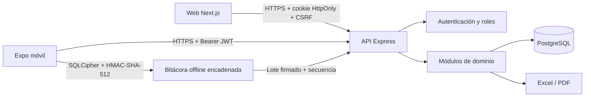
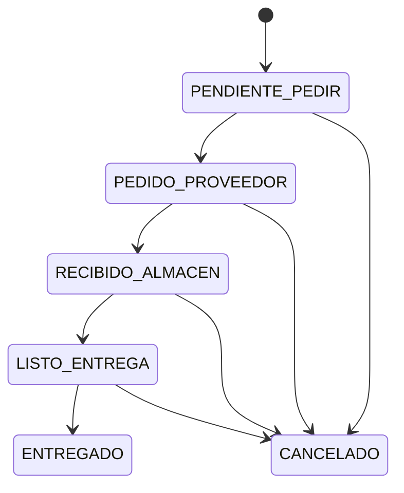

# Arquitectura

## Decisiones y deuda visible

Este documento explica la forma actual del sistema. El motivo, costo aceptado, invariantes y disparadores de cambio de cada elección viven en el [registro de decisiones arquitectónicas](DECISIONES_ARQUITECTURA.md). Las limitaciones conocidas, su riesgo y criterio verificable de salida viven en [deuda técnica](DEUDA_TECNICA.md).

Una tecnología distinta no es automáticamente una mejora. Antes de reemplazar PostgreSQL, separar microservicios, mover reglas al cliente o cambiar el protocolo offline, debe identificarse el ADR vigente y demostrar que se cumplió su condición de revisión.

## Principios

El repositorio separa presentación, reglas de negocio y persistencia. El backend está dividido por módulos de dominio; no existe un controlador único ni acceso directo a PostgreSQL desde las interfaces. Las transacciones de Prisma son el límite de consistencia para ventas, abonos, compras y entregas.

La organización es **por funcionalidad**, no por un gran archivo técnico. Una pantalla sólo compone; un hook orquesta; una función de dominio calcula; un repositorio persiste; y una ruta HTTP valida/delega. Esta dirección de dependencias evita que React, Express, Prisma o SQLite se conviertan en el lugar donde vive todo el negocio.



## Módulos de backend

- `autenticacion`: inicio, rotación de sesión, cierre y contraseña.
- `usuarios`: altas y control de roles.
- `clientes` y `localidades`: expediente, datos cifrados, saldo e historial.
- `rutas`: localidades, orden de clientes y jornada diaria.
- `ventas`: cálculo en servidor, plan de cuotas y salida de stock.
- `cobranza`: abonos, aplicación a cuotas y riesgo.
- `inventario` y `compras`: catálogo y libro de movimientos.
- `pedidos`: máquina de estados y conversión a venta al entregar.
- `sincronizacion`: validación HMAC, aplicación atómica, idempotencia y bitácora del lote.
- `reportes`: indicadores, Excel con fórmulas y PDF de surtido.

Dentro de un módulo complejo se conserva la misma separación. Por ejemplo, `ventas` contiene esquema de entrada, cálculos puros, reserva de inventario, registro de saldo y orquestación transaccional. `sincronizacion` contiene esquemas, comparación de integridad, procesador idempotente y una ruta HTTP mínima. Así se prueban cuotas e integridad sin arrancar Express.

## Capas de interfaz

La web y el móvil usan módulos de funcionalidad:

```text
app/                         rutas; sólo composición y navegación
src|modulos/<funcionalidad>/
  dominio*.ts                reglas puras, deterministas
  usar*.ts                   estado y orquestación de casos de uso
  Componente*.tsx            presentación y accesibilidad
infraestructura/             SQLCipher, red y detalles del dispositivo
repositorios/                jornadas, caché y bitácora offline
```

En móvil, `almacenLocal.ts` es una fachada estable. Las pantallas no conocen tablas ni claves: `infraestructura/baseLocal.ts` abre SQLCipher y migra; `repositorios/datosLocales.ts` maneja proyecciones; `repositorios/operacionesLocal.ts` conserva la outbox encadenada. Jornada, venta y entrega siguen el mismo diseño y sus archivos de ruta sólo ensamblan componentes.

En web, los flujos de ventas y pedidos separan carga/mutaciones en hooks, tablas/tarjetas en componentes y formularios en piezas reutilizables. `CamposPlanCredito` es compartido por venta y entrega para que ambas experiencias soliciten exactamente los mismos datos.

## Convenciones antimonolito

- Una ruta no implementa reglas financieras ni SQL; valida, autoriza y delega.
- Una página no llama a cinco servicios mientras renderiza una tabla y dos formularios; esa orquestación pertenece a un hook.
- Un componente tiene un propósito visible. Los subformularios repetidos se comparten.
- Las funciones de dominio reciben datos y regresan datos; no muestran alertas ni escriben en almacenamiento.
- Los efectos de inventario y saldo permanecen separados aunque participen en la misma transacción.
- Al crecer un archivo, se separa por responsabilidad, no en archivos genéricos llamados `helpers` o `utils`.
- Los barrels/fachadas exponen contratos estables; la UI no importa implementaciones de Prisma o SQLite.

## Modelo financiero

`SaldoCliente` es una proyección rápida; `MovimientoSaldo` es el libro append-only que explica cada cambio. `Venta`, `PlanPago`, `Cuota`, `Abono` y `AplicacionAbono` preservan el detalle. No se guarda “lo que paga por semana” en el cliente porque cada venta puede tener condiciones distintas.

## Integridad offline

El móvil aplica el patrón outbox: primero confirma en una transacción SQLCipher la operación y su proyección visible; después intenta enviarla. Cada registro tiene secuencia, huella anterior, HMAC-SHA-512, estado, intentos y último error. La clave de integridad se guarda por separado en SecureStore y se registra por TLS al enrolar el dispositivo.

PostgreSQL conserva por usuario/dispositivo la última secuencia y hash aceptados. La API toma un candado sobre esa ancla, exige HMAC en cada operación y en el lote, vuelve a calcularlos y rechaza cambios, huecos, duplicados con contenido distinto o reordenamientos. El lote se aplica completo en una sola transacción: si una regla de saldo, stock, precio, pedido o alcance falla, tampoco avanza la cadena. `OperacionSincronizada` y los identificadores móviles estables hacen idempotente un reintento idéntico.

Este mecanismo evidencia manipulación de la historia anclada, pero no promete inmutabilidad absoluta ante un teléfono totalmente comprometido que todavía conserve sesión y clave válidas. La revocación administrativa del dispositivo, MDM y los controles de precio, cartera y corte limitan ese riesgo.

### Cobranza fuera de ruta

`RutaLocalidad` modela una ruta de una o muchas localidades, `RutaCliente` conserva la asignación ordenada y `Ruta.cobradorId` define al responsable. Los filtros de datos de la API se aplican además del permiso por rol. El directorio móvil sólo contiene clientas de rutas activas asignadas a ese cobrador. Una visita extraordinaria puede ser fuera de la ruta abierta, pero la clienta debe pertenecer a otra ruta activa del mismo cobrador. PostgreSQL deriva `fueraDeRuta`; la interfaz no puede elegirlo ni modificar `RutaCliente`.

## Flujo de pedido



Sólo `ENTREGADO` crea una venta, descuenta inventario y, si es crédito, aumenta saldo. Los pedidos nuevos referencian obligatoriamente un producto activo; nombre y precio se copian desde el catálogo. Cada detalle de venta guarda también nombre, SKU, marca, costo y precio como fotografía histórica, por lo que la baja lógica posterior del producto no altera comprobantes ni reportes pasados.

## Escalabilidad

La API es stateless salvo PostgreSQL. Puede ejecutar varias réplicas detrás de un balanceador. En producción conviene añadir Redis para límites distribuidos y trabajos programados, almacenamiento de objetos para comprobantes y un trabajador para reportes grandes. Los folios actuales son únicos y legibles; para contabilidad fiscal se debe integrar la serie consecutiva autorizada correspondiente.
