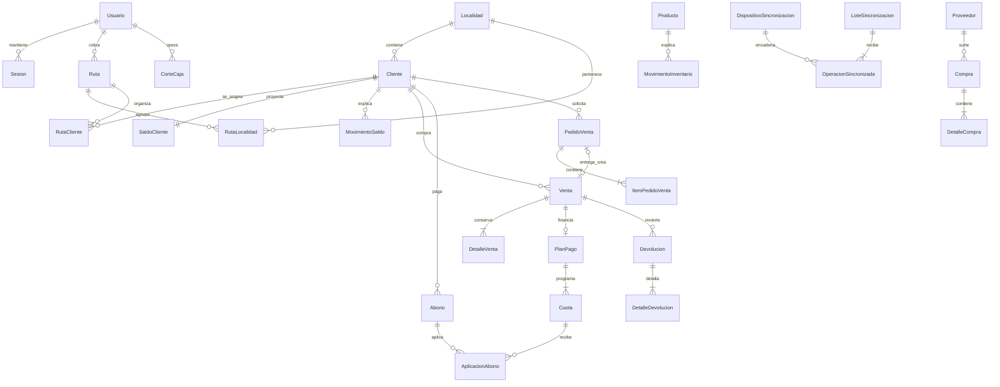

# Modelo de datos

PostgreSQL es la fuente de verdad. Prisma describe el modelo de aplicación y cada restricción crítica adicional vive en una migración SQL versionada. Los diagramas son orientativos; `back/prisma/schema.prisma` y `back/prisma/migrations/` mandan.

## Relaciones principales

## Diccionario por agregado

| Agregado   | Tablas                                                                             | Responsabilidad                                                                                    |
| ---------- | ---------------------------------------------------------------------------------- | -------------------------------------------------------------------------------------------------- |
| Identidad  | `usuarios`, `sesiones`                                                             | Rol, bloqueo, MFA, versión de token, familias de refresh y máximo de sesiones.                     |
| Cartera    | `localidades`, `rutas`, `rutas_localidades`, `rutas_clientes`                      | Agrupación multilocalidad y orden de visita. El cobrador es opcional: sin asignación se opera sólo en web administrativa. |
| Cliente    | `clientes`, `saldos_clientes`, `movimientos_saldo`, `evaluaciones_riesgo`          | Expediente, proyección de deuda, libro de cargos/abonos y evaluación derivada.                     |
| Venta      | `ventas`, `detalles_venta`, `planes_pago`, `cuotas`                                | Contado/crédito, snapshots históricos, calendario y fechas cliente/servidor/operativa.             |
| Cobranza   | `abonos`, `aplicaciones_abono`, `visitas_cobranza`                                 | Pago, aplicación FIFO a cuotas, anulación compensatoria y visita ordinaria/extraordinaria.         |
| Inventario | `productos`, `movimientos_inventario`                                              | Catálogo/foto privada, existencia proyectada y libro de entradas/salidas.                          |
| Compra     | `proveedores`, `compras`, `detalles_compra`                                        | Proveedor que surtió, factura/entrada y costo histórico.                                           |
| Pedido     | `pedidos_venta`, `items_pedido_venta`                                              | Solicitud, proveedor por artículo, recepción y entrega que crea una sola venta.                    |
| Devolución | `devoluciones`, `detalles_devolucion`                                              | Autorizador, operador de caja, evidencia, saldo, reembolso e inventario.                           |
| Caja       | `cortes_caja`                                                                      | Importes calculados/declarados por método, diferencia, firma e integridad por operador/día.        |
| Offline    | `dispositivos_sincronizacion`, `lotes_sincronizacion`, `operaciones_sincronizadas` | Ancla HMAC, recibos confirmados/rechazados y resolución administrativa.                            |
| Auditoría  | `auditoria`                                                                        | Actor, acción y cambios sanitizados; no almacena secretos ni binarios.                             |

## Campos sensibles

| Campo/categoría                               | Tratamiento                                                                       |
| --------------------------------------------- | --------------------------------------------------------------------------------- |
| `Cliente.telefonoCifrado`, `direccionCifrada` | AES-256-GCM con `FIELD_ENCRYPTION_KEY`.                                           |
| `telefonoHash`                                | HMAC-SHA-256 con `SEARCH_HMAC_KEY`; `telefonoHashVersion` permite transición.     |
| `Usuario.hashContrasena`                      | Argon2id; nunca reversible.                                                       |
| `mfaSecretoCifrado`, `claveIntegridadCifrada` | AES-256-GCM; no se devuelve a listados.                                           |
| Fotos de producto/devolución                  | Binario privado, MIME permitido y SHA-256 de integridad; respuestas autenticadas. |
| Tokens de sesión                              | Sólo hash SHA-256 del token aleatorio; una reutilización revoca la familia.       |
| Coordenadas/referencias/notas                 | Datos personales/financieros de acceso mínimo; no se incluyen en logs.            |

Las claves de cifrado no viven en la base ni en Git. Una restauración sin `FIELD_ENCRYPTION_KEY` conserva bytes pero no recupera PII; la custodia debe restaurarse por separado.

## Libros y proyecciones

- `movimientos_saldo` explica `saldos_clientes.saldoActual`. Cada fila conserva anterior/nuevo y referencia.
- `movimientos_inventario` explica `productos.existencia`. Cada fila conserva existencia antes/después.
- Venta, abono, devolución y corte son hechos; saldo/existencia/riesgo son vistas materializadas por la aplicación.
- `npm run reconciliar` reconstruye en sólo lectura y sale con código `2` ante diferencias. Nunca corrige automáticamente.
- Una reparación crea un movimiento compensatorio autorizado y auditado; no actualiza un libro histórico.

## Integridad e índices importantes

- Decimal monetario: `Decimal(12,2)`, máximo de contrato `9,999,999,999.99`, checks de signo/relación para filas nuevas.
- Unicidad: folios, SKU/códigos, tarjeta, `idOperacionMovil`, sesión hash, operación offline y corte `(operador, fechaOperativa)`.
- Concurrencia: bloqueos de jornada/venta/cliente/producto y advisory locks para administrador, login, sesión e idempotencia.
- Alcance: índices `Ruta(cobradorId, activa, diaSemana)`, cliente-localidad y asignación de ruta.
- Cortes: índices de `fechaOperativa` en venta/abono; la hora enviada por el móvil no cambia el día contable del servidor.
- Offline: unicidad `(usuarioId, dispositivoId, secuencia)`, hash anterior/contenido y recibo terminal.

## Borrado y retención

Las claves foráneas de libros usan `Restrict`; catálogos/usuarios/clientes se dan de baja lógicamente. `Cascade` sólo elimina detalles cuya identidad depende totalmente de su padre y no autoriza borrar el hecho raíz. Los plazos exactos dependen de la revisión legal en `PRIVACIDAD_DATOS.md`.

## Migraciones

1. Desarrollo crea SQL explícito; producción sólo ejecuta `prisma migrate deploy`.
2. Revisar locks, backfill, duración, espacio, reversibilidad binaria y compatibilidad con la app móvil anterior.
3. Preferir expandir → rellenar → cambiar lectores → contraer en versiones distintas.
4. Una migración que desactive/transforme filas reporta conteos en notas de liberación. `20260820030000_integridad_piloto` desactiva rutas activas huérfanas antes del check; deben asignarse antes de reactivarlas.
5. Respaldo restaurable y reconciliación íntegra son condiciones de despliegue.

## Archivo futuro

No se particiona por anticipación. Al superar los umbrales definidos en `DEUDA_TECNICA.md`, movimientos/auditoría se particionarán por fecha sin cambiar IDs ni relaciones. Un archivo conserva consultas legales, huellas y trazabilidad; nunca se usa para esconder diferencias.
